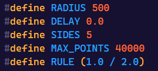
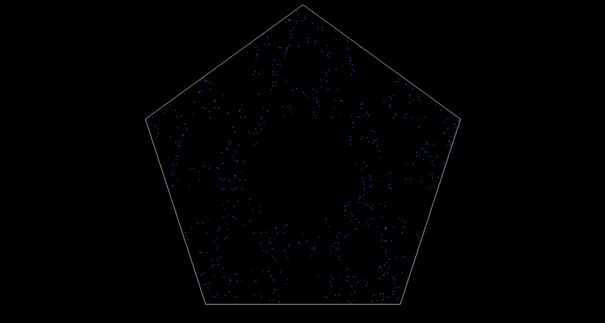
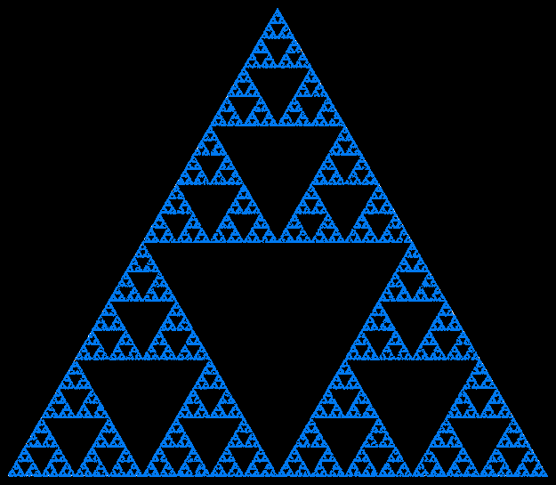
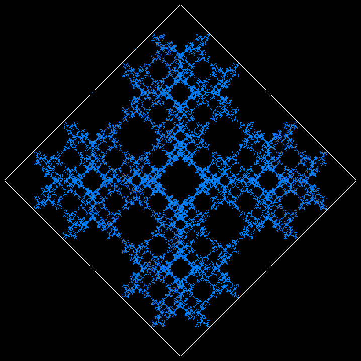

<h1 align="center">ChaosGame</h1>

  

    <strong>A fractal generator based on a rule to follow and a list of vertex.</strong>
  

  

    
    
  

## Description
Made with C++ using raylib to render. It uses a rule to mark the next point and, over time, generates a fractal.

## Config
These are the settings that can be configured:

    

## Generating a fractal

    

## Other examples

    
    

## Author

| [ @rafafelps](https://github.com/rafafelps)  |
| :---: |
